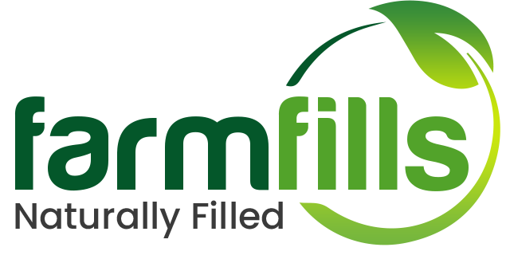

# Farmfills

Farmfills is a venture delivering dairy products since 2017. [Visit Website](https://farmfills.com)
This is the web application of farmfills made with django where customers can order products.

## Installation

Download farmfills source code as zip and unzip it into a directory.
Install virtual environment.
For Linux:
```
   $	sudo apt-get install python-pip
   $	pip install virtualenv
   $	virtualenv virtualenv_name
   $	source virtualenv_name/bin/activate
```
For Windows:
```
   $	pip install virtualenv
   $	virtualenv myenv
   $	myenv\Scripts\activate.bat
```
Then, install required packages
```
   $	pip install -r requirements.txt
```

### Initialization

Create a `.env` file in the project directory as shown in the `.env.example` and add your credentials.

There is a loophole key and secret in the `.env` file which is used to access login of a customer if needed.

We use MSG91 for OTP and Message service. You have to create an account and get your auth key and set it up in the `.env` file.

At last create your database and migrate the data:
```
   $	python manage.py makemigrations
   $	python manage.py migrate
```

Add the crontab process as shown in the `.crontab` file:

### Run

```
   $	python manage.py runserver
```
